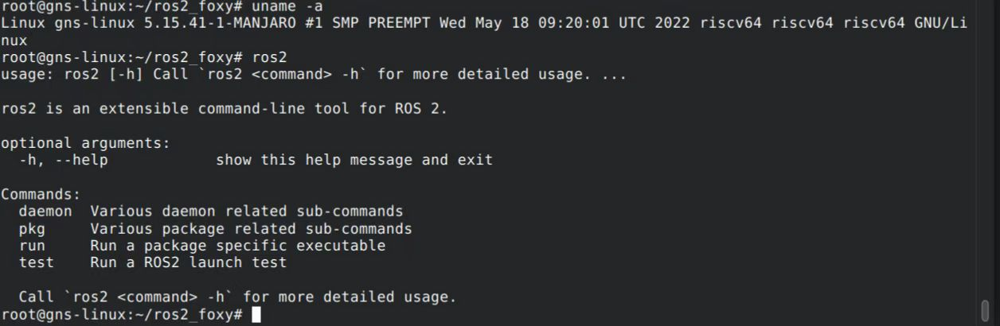

# ROS2 Foxy RISC-V Port

This project aims to deliver binary files of **ROS2 Foxy** for **riscv64** architecture.

**Disclaimer:** This project is still in a very early stage. DO NOT try it on a real-world robot!

Note: most of the ROS2 packages have not ported yet. Be patient :)

## Demo

